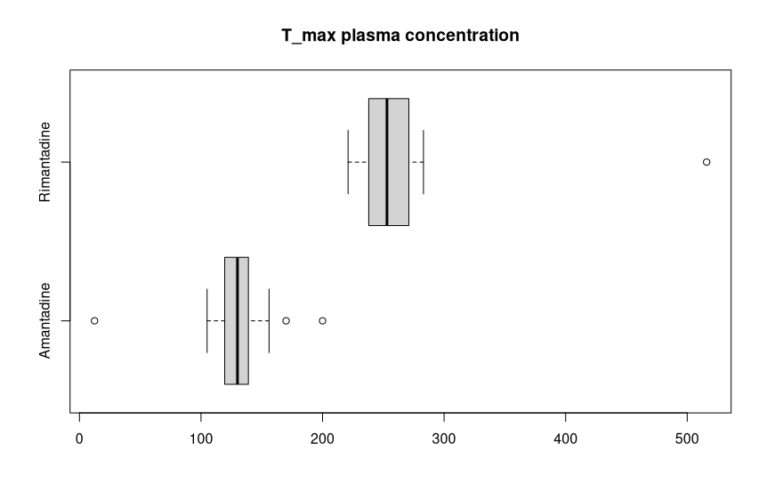
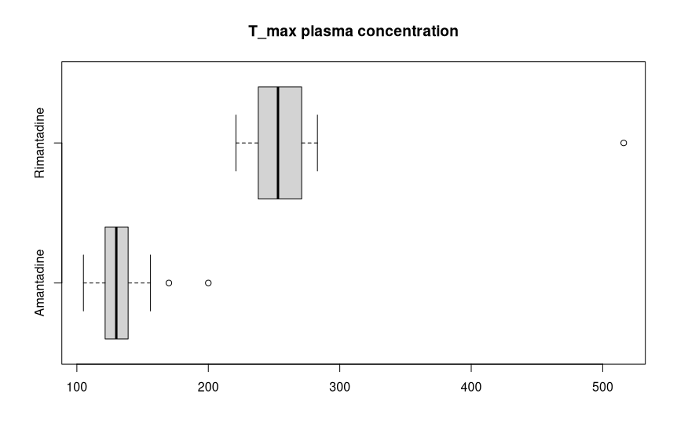

# BS_HW1

---

#### 1.
**(a)**

**(b)**

| set | $\bar{X}$ | $S^{2}$ |
| --- | --------- | ------- |
| A   | 128.07    | 1215.17 |
| R   | 267.35    | 4187.29 | 

According to the graph, the data of **set R** are more **dispersed** than the data of set A. most of the data of set A gather in \[100, 200\] interval, when the data of set B gather in \[200, 300\]. It can also be observed by the average of the data.

**(c)**

| set | $\bar{X}$ | $S^{2}$ |
| --- | --------- | ------- |
| A   | 133.95    | 477.31  | 
| R   | 267.35    | 4187.29 |

After the outliner of set A being removed, the average of set A is slightly increased, and the variance of set A is tremendously decreased.

**(d)**

It's clearly that there's a outliner(516) in set R. However, it's hard to say the data is caused by human error.

#### 2.
**(a)**

**(b)** the length of the flower differs, and the range of the length of the CaribaeaRed aren't overlapped to the one of the CaribaeaYellow 

**(c)**

| group          | Q1   | median | Q3   |
| -------------- | ---- | ------ | ---- |
| CaribaeaRed    | 38.1 | 39.2   | 41.6 |
| CaribaeaYellow | 35.6 | 36.1   | 36.8 | 

#### 3.
**(a)**

| group  | min   | Q1    | median | Q3    | max    |
| ------ | ----- | ----- | ------ | ----- | ------ |
| female | 29.00 | 60.00 | 71.00  | 85.00 | 99.00  |
| male   | 50.00 | 78.00 | 89.00  | 95.00 | 100.00 |

**(b)**

male in Bangladesh is a lot more illliterate than other male in Islamic Nations. I think it's because of the poverty of the country.(female in Bangladesh are more illliterate than the ones in other nation also, it however not be labeled as outliner in this diagram)

According to the back-to-back histogram, there are slightly more countries with higher male literacy rates than ones with higher female literacy rates.

#### 4.
**(a)**

+ regular test: 0.17
+ randomized test: 0.28

**(b)**

data of randomized test is dispersed than the ones of regular test after the data are normalized.